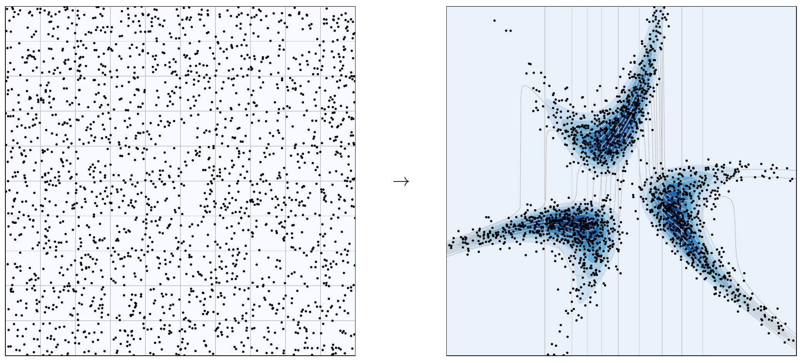

# Polynomial Transport

This library provides functionality to (approximatively) sample from non-trivial and high-dimensional probability measures. Prerequisites for the current implementation are that the measure is defined on [-1,1]^d and specified via a (potentially unnormalized) probability density function. In order to sample from such a distribution, we generate a polynomial approximation of the target density and then use this to construct the transport map that couples the uniform measure with the (approximate) target
measure. This transport map can also be understood as a coordinate transformation that transports uniformly distributed samples towards regions of high probability under the target measure:



This library provides the implementation of the algorithm introduced in [[1]](https://arxiv.org/abs/2311.04172), together with the numerical experiments presented therein.

## Dependencies

`numpy` `peewee`

## Outline

Basic use cases of this library for 1D and 2D test cases, as well as for a high-dimensional Bayesian Inverse Problem, can be found in the form of Jupyter notebooks in `notebooks`.

Core modules of this library are:

* `Densities.py`
    This module collects several densities, such as the `Uniform` density, `Gaussian` densities, two-dimensional geometrically shaped `Hat` and `Circle` densities, a `Rosenbrock`-type density and a `GaussianPosterior` density associated with a given forward operator. Several densities can be combined linearly in a `MultimodalDensity` class. Further custom density classes can be implemented by deriving from the base class `TargetDensity`.
* `Surrogates.py`
    Contains a class `Legendre`, which constructs and stores an approximation to a given target density in a Legendre polynomial basis. The approximation can be computed via classical or weighted least squares or via interpolation. The distribution of interpolation nodes can be specified.
* `Transport.py`
    Given a density surrogate in a Legendre basis, this class implements the Knothe-Rosenblatt transport mapping between the uniform and the target measure.
* `MultiIndex.py`
    This module provides `MultiIndex` classes (a dense and sparse implementation) as well as a `MultiIndexSet` class with several deriving classes that implement different types of multi-index sets (`TensorProductSet`, `TotalDegreeSet` and `SparseSet`) and that are used to construct polynomial ansatz spaces. It further contains a `MultiIndexTreeNode` and `MultiIndexTree` that are used in the transport map implementation.
* `Forward.py`
    This module collects forward operators, such as the convolution operator, that can be used together with the `GaussianPosterior` density to express the posterior density of a Bayesian Inverse Problem.
* `Database.py`
    SQLite functionalities for storing the results of larger scale runs.

## Testing

In a shell, simply run `pytest` in order to execute the basic unit tests in the `test` directory.

## Citation

If you found this library useful in your research, please consider citing [the paper](https://arxiv.org/abs/2311.04172):

```
@article{westermann2023measure,
  title={Measure transport via polynomial density surrogates},
  author={Westermann, Josephine and Zech, Jakob},
  journal={arXiv preprint arXiv:2311.04172},
  year={2023}
}
```